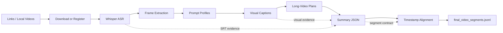

<h1 align="center">Video Timestamp Summary</h1>

<p align="center">
  <strong>Turn messy video batches into timestamped, evidence-grounded summary JSONL.</strong>
</p>

<p align="center">
  Batch download, ASR, frame extraction, visual captioning, long-video planning,<br>
  structured summarization, timestamp alignment, and final JSONL assembly, packaged as a Codex skill.
</p>

<p align="center">
  
  
  
  
  
</p>

---

## What It Builds

`video-timestamp-summary` turns video links or local video files into `final_video_segments.jsonl`, where each row keeps the source URL, title, full-video abstract, segment summaries, and segment-aligned timestamps.

```json
{
  "time_stamp": [[0, 0], [1, 15], [16, 38]],
  "segment": [
    {"title": "", "seg_abs": ["全文摘要"]},
    {"title": "分段标题", "seg_abs": ["分段摘要"]}
  ],
  "url": "原视频链接",
  "tt": "视频标题",
  "dctt": "全文摘要"
}
```

## Pipeline



## Why It Is Useful

| Capability | What it handles |
| --- | --- |
| Batch inputs | `txt`, `md`, `csv`, `jsonl`, `xlsx`, and local videos |
| Social video download | `yt-dlp` for common platforms, plus a Douyin helper script |
| Evidence-first summaries | ASR, frames, captions, metadata, plans, and timestamps stay aligned |
| Long-video control | Optional planning stage keeps dense videos organized before summarization |
| Resume-friendly runs | Each stage skips valid outputs and supports narrow reruns |
| Final contract | Deterministic builder validates summaries and timestamps before JSONL output |

## Requirements

- Python 3.12+
- PowerShell
- `ffmpeg` and `ffprobe`
- `yt-dlp`
- Python packages from `requirements.txt`
- PyTorch and Whisper for ASR
- OpenAI-compatible chat and vision model access for model-calling stages

Install the lightweight Python dependencies:

```powershell
python -m pip install -U pip
python -m pip install -r requirements.txt
```

Install PyTorch separately for your machine. For Whisper, CUDA, model weights, and ffmpeg checks, see [references/whisper-setup.md](references/whisper-setup.md).

## Quick Start

Create a batch workspace and copy the bundled scripts into it:

```powershell
New-Item -ItemType Directory -Force -Path .\work | Out-Null
Copy-Item -Path .\scripts\* -Destination .\work -Force
Copy-Item -Path .\references -Destination .\work -Recurse -Force
Set-Location .\work
```

Configure model access:

```powershell
$env:OPENAI_MODEL = "gpt-5.4-mini"
$env:OPENAI_BASE_URL = "https://your-openai-compatible-base-url"
$env:OPENAI_API_KEY = "sk-..."
```

Run the full pipeline:

```powershell
python download_videos.py --input video_links.txt
python asr_batch.py --input video --output asr --model-name large-v3-turbo --model-path "$env:USERPROFILE\.cache\whisper\large-v3-turbo.pt"
powershell -NoProfile -ExecutionPolicy Bypass -File .\extract_frames.ps1
python prompt_profile_batch.py
python caption_batch.py
python plan_batch.py
python summary_batch.py
python timestamp_batch.py
python build_final_jsonl.py --strict
```

For safer test runs, most stages support `--dry-run`, `--limit`, `--only`, and stage-specific force flags.

## Stage Outputs

| Stage | Main command | Primary output |
| --- | --- | --- |
| Download | `python download_videos.py --input video_links.txt` | `video/`, `video_title_url_mapping.csv` |
| ASR | `python asr_batch.py --input video --output asr` | `asr/transcript/{video}.srt` |
| Frames | `.\extract_frames.ps1` | `frame/{video}/`, `frame_manifest.csv` |
| Profiles | `python prompt_profile_batch.py` | `prompt_profiles/profiles.json` |
| Captions | `python caption_batch.py` | `caption/captions/{video}.txt` |
| Plans | `python plan_batch.py` | `plan/{video}.txt` |
| Summaries | `python summary_batch.py` | `abstract/summaries/{video}.json` |
| Timestamps | `python timestamp_batch.py` | `timestamp/time_stamps/{video}.json` |
| Final build | `python build_final_jsonl.py --strict` | `final_video_segments.jsonl` |

## Design Rules

- Generate facts only from video metadata, ASR, captions, frames, plans, summaries, and timestamp evidence.
- Keep video stems aligned across every stage.
- Preserve `segment[0]` as the full-video summary.
- Preserve segment/timestamp alignment: `time_stamp[0]` is `[0, 0]`, and `len(time_stamp) == len(segment)`.
- Prefer stage-local resume and targeted repair before rerunning the whole batch.

## Documentation Map

| File | Use it when you need |
| --- | --- |
| [SKILL.md](SKILL.md) | Codex skill entry point and core workflow |
| [references/setup-and-inputs.md](references/setup-and-inputs.md) | Project setup, inputs, local videos, and model config |
| [references/download-and-asr.md](references/download-and-asr.md) | Download, ASR, and frame extraction stages |
| [references/model-pipeline.md](references/model-pipeline.md) | Prompt profiles, captions, plans, summaries, and timestamps |
| [references/output-contract.md](references/output-contract.md) | Summary, timestamp, and final JSONL contracts |
| [references/rerun-debugging.md](references/rerun-debugging.md) | Resume strategy and partial-run repair |
| [references/whisper-setup.md](references/whisper-setup.md) | Whisper, PyTorch, CUDA, ffmpeg, and model weights |

## Repository Layout

```text
.
|-- SKILL.md
|-- agents/
|   `-- openai.yaml
|-- references/
|   |-- download-and-asr.md
|   |-- model-pipeline.md
|   |-- output-contract.md
|   |-- rerun-debugging.md
|   |-- setup-and-inputs.md
|   `-- whisper-setup.md
`-- scripts/
    |-- download_videos.py
    |-- asr_batch.py
    |-- extract_frames.ps1
    |-- prompt_profile_batch.py
    |-- caption_batch.py
    |-- plan_batch.py
    |-- summary_batch.py
    |-- timestamp_batch.py
    `-- build_final_jsonl.py
```

## Safety Notes

Generated videos, transcripts, frames, captions, logs, and final JSONL files are intentionally ignored by git. Keep API keys in environment variables or local `.env` files, never in tracked files.

## License

MIT. See [LICENSE](LICENSE).
